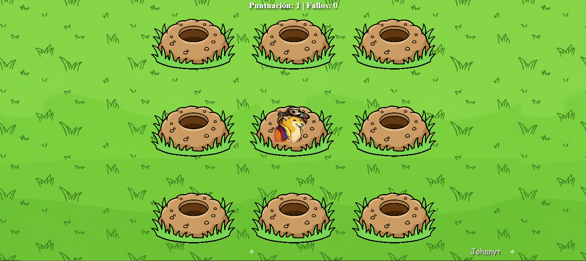
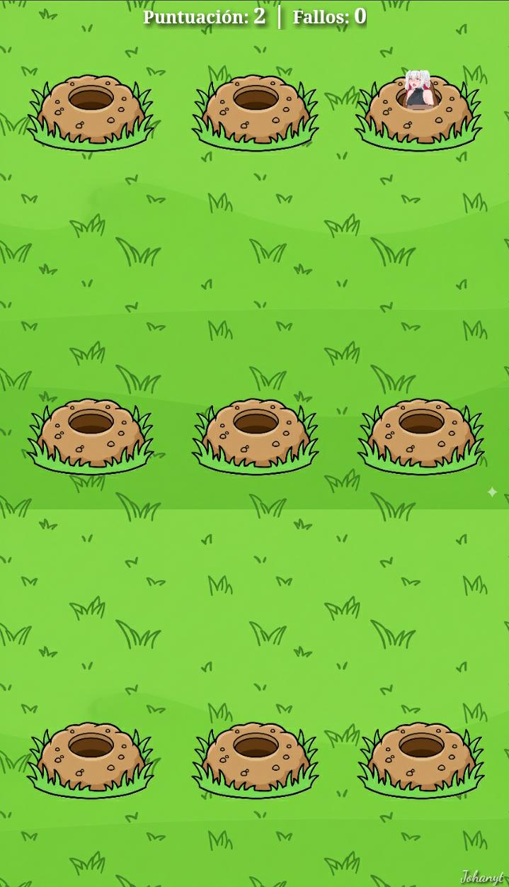

# 🎮 Juego del Topo — Johanyt

**Juego del Topo** es mi propia versión del clásico "Whac-a-Mole" pero con un giro divertido:  
además de la jugabilidad tradicional, incluye **colombianadas y groserías** que lo hacen más **cómico y único**. 🇨🇴😂  

👉 [Jugar ahora en GitHub Pages](https://joganyt01.github.io/juego-topo/)

---

## 📸 Capturas del juego

### 🖥️ Versión Desktop

### 📱 Versión Móvil

---

## ✨ Características

- Juego interactivo estilo "golpear al topo" 🛠️  
- Contador de **puntuación** y **fallos** 📊  
- **Sonidos graciosos y groserías colombianas** 🤣  
- Diseño responsive: funciona en **PC y móvil** 📱💻  
- Marca de agua personalizada con mi firma: **Johanyt** 🖋️  
- Fondo de césped dinámico 🌱  

---

## 🚀 Demo en Vivo

👉 [Probar el juego aquí](https://joganyt01.github.io/juego-topo/)

---

---

## 🛠️ Requisitos

- Navegador moderno (Chrome, Edge, Firefox, Safari)  
- Conexión a internet para acceder al sitio  

---

## 👨‍💻 Autor

Desarrollado con ❤️ por **Johanyt**  

---

